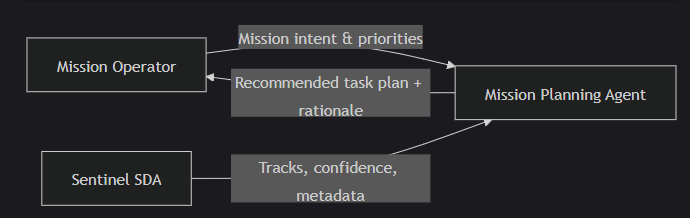
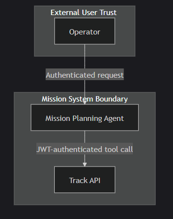

# Agentic Mission Planning Architecture

This document describes the Mission Planning Agent as a decision-support subsystem within Sentinel SDA. The agent is human-in-the-loop and produces recommendations only.

## System Context

## Logical Architecture

## Hybrid Decisioning Model

The agent uses two layers:

1. Deterministic rules layer: Applies hard constraints, scores candidates, and produces ranked recommendations that are reproducible and auditable.

2. Explainable AI layer (optional): Produces a short rationale summary and can break ties among close scores using operator intent. This layer does not override hard constraints.

## Trust Boundaries and Controls

### Controls:

- Zero Trust access model with JWT authentication
- Explicit interfaces and schemas for plan requests and outputs
- Human-in-the-loop recommendations only, no autonomous execution
- Auditable scoring and constraint evaluation per recommendation

## Failure and Degradation
| Failure | Expected Behavior |
| --------| ----------------|
| Track API unavailable | Agent returns degraded plan with clear error and no recommendations |
| LLM unavailable | Agent returns deterministic rule-based recommendations without rationale |
| No tracks available | Agent returns an empty plan with guidance for operator next steps |