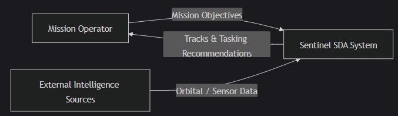
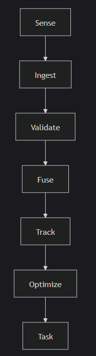
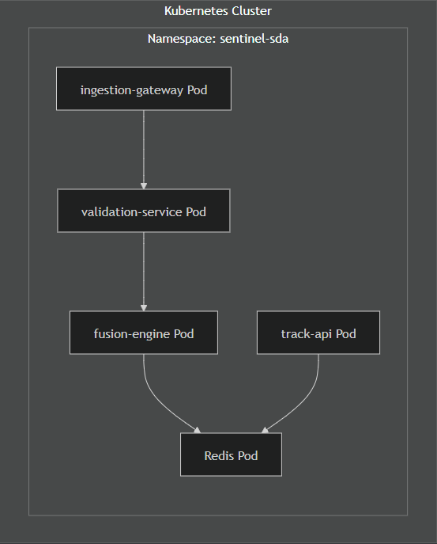

# System Architecture

## Architectural Overview
SENTINEL-SDA is implemented as a set of loosely coupled microservices deployed on Kubernetes. Each service has a clearly defined responsibility and communicates over authenticated APIs.

## Major Components
- Sensor Simulators
- Ingestion Gateway
- Validation Service
- Fusion Engine
- Track Store
- Track Query API
- Mission Optimizer
- Tasking Service
- Observability Stack

## Data Flow
1. Sensor simulators emit observation events
2. Ingestion Gateway receives and forwards events
3. Validation Service enforces schema and sanity checks
4. Fusion Engine updates object tracks
5. Tracks are persisted and exposed via API
6. Mission Optimizer evaluates priorities
7. Tasking Service issues sensor directives

## Design Principles
- Separation of concerns
- Fail-fast validation
- Graceful degradation
- Automation-first operations
- Security as an architectural constraint

## System Context Diagram

Defines the system boundary, external actors, and mission interfaces.

## Functional Architecture

Describes what the system does, independent of implementation.

## Logical Architecture

Shows logical components, service responsibilities, and data flow.

## Physical Architecture (Kubernetes Deployment View)

Maps the logical system onto runtime infrastructure.

## Assumptions and Constraints

Explicitly documents engineering tradeoffs.

### Assumptions

- JWT secrets are pre-provisioned via Kubernetes Secrets
- Redis consistency is sufficient for demo-scale workloads
- Sensor simulators approximate real-world telemetry patterns

### Constraints

- Docker Desktop Kubernetes does not enforce NetworkPolicies
- No persistent storage guarantees in local environment
- Single-namespace deployment for simplicity

## Failure and Degradation Model

Expected system behavior under fault conditions.

| Failure Condition | Expected Behavior|
|-------------------|---------------------|
| Sensor outage | Reduced confidence, continued tracking|
| Validation unavailable | Ingestion fails closed|
| Fusion restart | Temporary track staleness, automatic recovery|
| Redis unavailable | Track API degraded or unavailable|

## Agentic Decision Support Layer

Sentinel SDA includes a Mission Planning Agent that consumes object tracks and mission intent to generate human-in-the-loop tasking recommendations using a hybrid rules-plus-AI approach. See `docs/agentic_architecture.md` for diagrams, trust boundaries, and failure behavior.